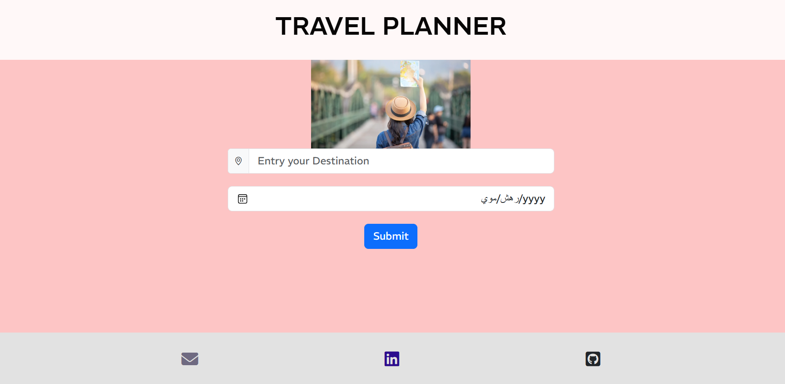

  

<h3 align="center">webpack-demo</h3>

---

 The Udacity Travel App project is a web development project that involves creating a travel application for users to explore and plan their trips..
      

## Table of Contents

- [APIs used](#api)
- [Technologies used](#tech)
- [File Structure](#file)
- [Solution steps](#getting_started)
- [Basic requirements](#Prer)
- [Running](#run)
- [testing](#tests)
- [Deployment](#deployment)
- [Authors](#authors)

## APIs used 
- Geonames
- Weatherbit
- Pixabay

## Technologies used 
- HTML
- CSS
- JS
- webpack
- SASS
- Node.js

## File Structure 
The project has the following file structure

- [.vscode/](.vscode)
    - [app.test.js](.vscode/settings.json)
- [node_modules/](node_modules)
- [result/](result)
- [src/](src)
    - [client/](src/client)
        - [public/](src/client/public)
            - [images/](src/client/public/images)
            - [styles/](src/client/public/style)
        - [script/](src/client/script)
            - [handleForm.js](src/client/script/handleForm.js)
        - [views/](src/client/views)
            - [index.html](src/client/views/index.html)
        - [index.js](src/client/index.js)
    
    - [server/ ](src/server)
        - [getCityLoc.js](src/server/getCityLoc.js)
        - [getCityPic.js](src/server/getCityPic.js)
        - [index.js](src/server/index.js)
        - [weatherTemp.js](src/server/weatherTemp.js)
- .babelrc
- .env
- .gitignore
- package-lock.json
- package
- README.md
- webpack.common.js
- webpack.dev.js
- webpack.prod.js

## About 
web development process for a Udacity Travel app project:
This project is one of the projects in Udacity that uses some technologies such as webpack, sass, and others to create a flight booking website.

## Solution steps 
- Choosing a suitable design

- Using a webpack

- using Node.js and some libraryof js

- Implementing the design in Index.html

- Design Formatting Using Sass, Bootstrap, and CSS

- Writing JavaScript codes

- Calling and using API

- Ensuring implementation

### Basic requirements

Web Browser: You will need a modern web browser such as Google Chrome, Mozilla Firefox, Safari, or Microsoft Edge to run and test your web application.

Text Editor or Integrated Development Environment (IDE): You will need a text editor or IDE to write and edit the code for the project.

Node.js: This project uses Node.js so you will need to download one of its versions.

Package Manager: Depending on your project setup, you may need a package manager such as npm (Node package manager) or Yarn to manage project dependencies and install external libraries or frameworks.

Server-side frameworks and libraries: If your project requires a server-side framework such as Express.js

## 🔧 Running 
1. Download/Clone this repository
2. cd into the new folder and Install all dependancies
3. put npm install on the terminal
4. cd webpack-demo
5. npm run build-dev

#####  This project is running on: http://localhost:8000/

## 🔧 Running the tests 

npm run test will run jest in the terminal and get you the results
you are free to make more jest testing on your version of the project.

## 🚀 Deployment 

One of the most important features of any project is the ability to develop, and this project is scalable, but this is just a brief overview of the use of some technologies.

## ✍️ Authors 

- [@maisSarhan]

